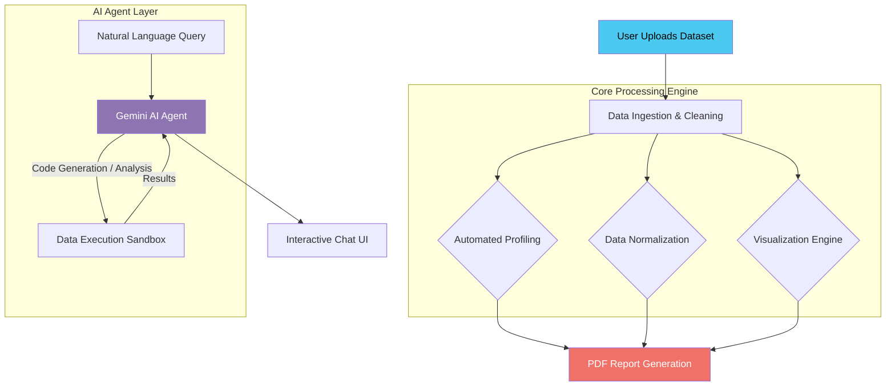

<div align="center">

# 🧞 Insight-Agent (Insight Genie)

**AI-Powered Automated Data Insights & Exploratory Data Analysis (EDA) Generator**

[](https://www.python.org/)
[](https://streamlit.io/)
[](https://deepmind.google/technologies/gemini/)
[](https://pandas.pydata.org/)
[](https://plotly.com/)
[](LICENSE)

</div>

---

## 📌 Problem

Data analysis can be a time-consuming and manual process. Analysts spend hours writing boilerplate code for data cleaning, profiling, and visualization before they can uncover actionable insights. **Insight-Agent (Insight Genie)** solves this by providing a fully automated, AI-driven platform that performs exploratory data analysis (EDA), generates intelligent visualizations, and allows users to query their datasets using natural language — dramatically reducing the time from raw data to business intelligence.

---

## 🛠️ Tech Stack

| Component | Technology |
|---|---|
| **Frontend UI** | Streamlit |
| **AI / LLM Agent** | Google Gemini API |
| **Data Processing** | Pandas, Scikit-learn, NumPy |
| **Automated Profiling** | ydata-profiling |
| **Visualizations** | Plotly Express, Seaborn, Matplotlib |
| **Report Generation** | PyPDF2, pdfkit, fpdf |

---

## 🏗️ Architecture



---

## 🔗 Demo

👉 **Live App:** [https://insight-agent-ag.streamlit.app/](https://insight-agent-ag.streamlit.app/)

---

## ✨ Features

- **📊 Automated Data Profiling:** Instantly generates comprehensive statistical profiles and correlation matrices using `ydata-profiling`.
- **🧹 Intelligent Data Cleaning:** Automatically handles missing values, normalizes datasets (via Scikit-learn), and prepares data for analysis.
- **💬 Natural Language Data Chat:** Ask questions about your dataset in plain English. The Gemini-powered agent writes and executes code to fetch answers.
- **📈 Smart Visualizations:** Auto-generates Plotly, Seaborn, and Matplotlib charts (time-series, bar charts, scatter plots) based on column data types.
- **📑 PDF Report Generation:** Exports all generated insights, statistical summaries, and visualizations into a polished PDF report (`pdfkit`/`fpdf`).
- **💻 Syntax-Highlighted Code Generation:** The chat interface formats and highlights Python/Pandas code generated by the AI for full transparency.

---

## 🚀 Getting Started

### Prerequisites

- Python 3.9+
- A Google Gemini API Key

### Installation

1. **Clone the repository:**
   ```bash
   git clone https://github.com/KhuzaimaHassan/Insight-Agent.git
   cd Insight-Agent
   ```

2. **Create a virtual environment:**
   ```bash
   python -m venv venv
   source venv/bin/activate  # On Windows: venv\Scripts\activate
   ```

3. **Install dependencies:**
   ```bash
   pip install -r requirements.txt
   ```

4. **Set up environment variables:**
   Create a `.env` file in the root directory and add your Gemini API key:
   ```env
   GEMINI_API_KEY=your_api_key_here
   ```

### Running the App

Launch the Streamlit dashboard:

```bash
streamlit run app.py
```

---

## 🤝 Contributing

Contributions, issues, and feature requests are welcome! Feel free to check the issues page.

1. Fork the Project
2. Create your Feature Branch (`git checkout -b feature/AmazingFeature`)
3. Commit your Changes (`git commit -m 'Add some AmazingFeature'`)
4. Push to the Branch (`git push origin feature/AmazingFeature`)
5. Open a Pull Request

---

## 📄 License

This project is licensed under the **MIT License**.

---

<div align="center">

**Built with ❤️ by [Khuzaima Hassan](https://github.com/KhuzaimaHassan)**

</div>
