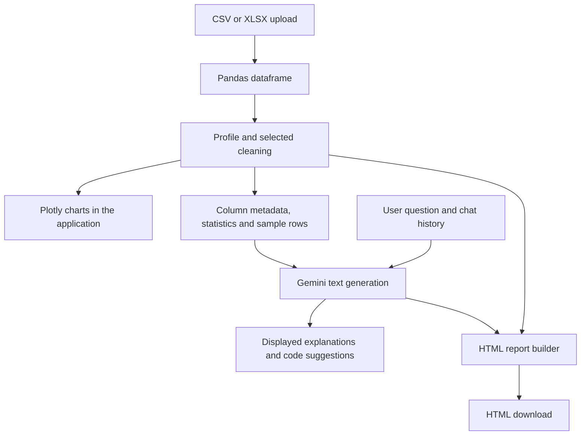

# Insight-Agent · Insight Genie

A Streamlit exploratory data analysis assistant for CSV and Excel datasets. Inspect Pandas summaries, choose cleaning operations, explore Plotly charts, request Gemini explanations, and export an HTML report.

**Streamlit · Pandas · Plotly · Google Gemini**

[Live app](https://insight-agent-ag.streamlit.app/) · [Project report](PROJECT_REPORT_PRIME.pdf) · [Setup](#run-locally) · [Example](#try-a-small-dataset) · [Implementation notes](#implementation-notes-and-limitations)

> **Project status:** This is a team prototype. Chat generates explanations and suggested Pandas code from supplied context; the application does not execute that generated code. Report downloads are HTML. The live Streamlit app may sleep after inactivity.

## What the application provides

| Area | Implemented behavior |
| --- | --- |
| Upload and preview | CSV and `.xlsx` upload through the UI, with a dataset preview. |
| Data profile | Row/column counts, missing-value percentage, column types, and descriptive statistics computed with Pandas. |
| Cleaning controls | User-selected row dropping or mean/median/mode filling; IQR-based capping for a selected numerical column. |
| Visualizations | Automatic Plotly histograms, categorical bars/boxes, numerical scatter plots, and date-based lines when suitable columns are available. Custom scatter, bar, and histogram controls are implemented. |
| AI insights and summary | Gemini receives summaries and sample rows to generate text. Basic fallback insights are available in the agent when the model is unavailable. |
| Chat with data | The app supplies column names/types, numerical summaries, categorical counts, up to five sample rows, and chat history to Gemini. Responses can contain displayed Pandas code; there is no execution sandbox. |
| Report export | Downloadable HTML containing the dataset profile/statistics and available summary/insight text. PDF export and chart embedding are not implemented. |

Cleaning changes the dataset held in the Streamlit session. Review the resulting row counts and values before interpreting charts or AI responses.

## How it works


```mermaid
flowchart TD
    U[CSV or XLSX upload] --> P[Pandas dataframe]
    P --> D[Profile and selected cleaning]
    D --> V[Plotly charts in the application]
    D --> C[Column metadata, statistics and sample rows]
    Q[User question and chat history] --> G[Gemini text generation]
    C --> G
    G --> A[Displayed explanations and code suggestions]
    D --> H[HTML report builder]
    G --> H
    H --> R[HTML download]
```

The diagram shows the implemented prompt/response flow. AI requests send dataset metadata, statistics, sample rows, and relevant conversation text to Google's Gemini service. Generated statements should be checked against the computed data summaries.

## Run locally

Use **Python 3.12** for the setup below. The repository contains older pinned dependencies; its pinned `ydata-profiling` distribution excludes Python 3.13 and later. Package presence does not establish that a feature is integrated into this app.

```bash
git clone https://github.com/KhuzaimaHassan/Insight-Agent.git
cd Insight-Agent
python -m venv .venv
```

Activate the environment:

```powershell
# Windows PowerShell
.\.venv\Scripts\Activate.ps1
```

```bash
# macOS / Linux
source .venv/bin/activate
```

Install the committed requirements:

```bash
python -m pip install -r requirements.txt
```

Create a `.streamlit` directory in the repository root, then create **`.streamlit/secrets.toml`**:

```toml
GOOGLE_API_KEY = "your_gemini_api_key_here"
```

Replace the placeholder with your Google Gemini API key for AI features. The code reads `st.secrets.get("GOOGLE_API_KEY")` in [gemini_agent.py](gemini_agent.py). A `.env` file containing `GEMINI_API_KEY` does not configure this code path, even though some current UI/error messages refer to `.env`. Keep the local secrets file out of Git.

For Streamlit Community Cloud, configure the same `GOOGLE_API_KEY` entry in the app's Secrets settings.

```bash
python -m streamlit run app.py
```

The agent currently defaults to `gemini-1.5-flash-latest` and performs a short connectivity test during initialization. Successful AI output depends on the configured model being available to the key. This documentation update does not establish current live-model availability or migrate the provider integration. An API-key warning is not sufficient to distinguish a bad key from an unavailable model.

## Try a small dataset

Save this illustrative data as `sample.csv`:

```csv
date,region,sales,orders
2026-01-01,North,120,3
2026-01-02,South,90,2
2026-01-03,North,,4
2026-01-04,South,180,5
2026-01-05,North,150,4
2026-01-06,South,110,3
```

1. Open **Data Analysis**, upload the CSV, and inspect its profile: **6 rows, 4 columns, 4.17% missing cells** before cleaning.
2. Choose **Fill with mean** and apply it. The missing `sales` value becomes **130**, with no missing cells remaining in this example.
3. Explore the automatic charts or create a custom scatter/bar/histogram. Outlier capping is an explicit additional action.
4. With a working Gemini configuration, use **Insights**, **Generate Summary**, or **Chat with Data**. For example: “Explain the sales distribution.” Check the response against the data; displayed code has not been run by the app.
5. Open **Generate Report**, choose **HTML**, and download the report. AI options depend on agent availability. The current HTML builder includes the data overview/profile and available text, without embedding the application's Plotly charts.

This sample is a reproducible walkthrough, not a measured model-quality benchmark.

## Implementation notes and limitations

- **Profiling:** The active profile uses custom Pandas functions. `ydata-profiling` is listed in requirements but is not called by the current application.
- **Normalization:** `normalize_data` exists in [utils.py](utils.py), but there is no normalization control wired into the current UI.
- **Report controls:** The format selector labels PDF as “Coming soon”; the download path always writes HTML. The HTML builder accepts a visualizations argument but does not use it. The recommendations request currently assigns its response without populating the list passed into the report.
- **Visualization controls:** Box/line charts can be generated automatically, while the custom chart selector also lists choices without corresponding custom-rendering branches. The implemented custom paths are scatter, bar, and histogram.
- **Input limits:** Empty datasets, all-missing categorical columns, or data without suitable numeric columns can cause errors in profiling/cleaning or chart controls. There is no demonstrated automatic handling of every dataset shape.
- **AI reliability:** Answers use the supplied context and model output. There is no generated-code executor, sandbox, or benchmark establishing exact answers across arbitrary datasets. Live provider calls were not validated as part of this README correction.
- **Dependencies:** Several reporting/profiling packages are present without an active PDF/profiling integration. The repository has no automated test suite or fully locked transitive dependency set.

Potential next implementation work includes provider/model refresh, stronger input validation, report chart/recommendation support, and completing the custom chart controls. PDF export and a code-execution sandbox would require new implementations.

## Project files

| File | Role |
| --- | --- |
| [app.py](app.py) | Streamlit tabs, session state, controls, chat prompts, and HTML-download flow. |
| [utils.py](utils.py) | File reading, Pandas profiles/cleaning, charts, and HTML report generation. |
| [gemini_agent.py](gemini_agent.py) | Streamlit-secret lookup, Gemini initialization, summaries, insights, and fallbacks. |
| [requirements.txt](requirements.txt) | Direct dependency pins and minimum versions. |
| [PROJECT_REPORT_PRIME.pdf](PROJECT_REPORT_PRIME.pdf) | Original team report and historical UI captures. Its generic “Feature X / Column A” results are illustrative examples, not a named-dataset benchmark. |

## Team and attribution

**Team Prime · NED University of Engineering and Technology**

Credits follow the committed project report:

| Team member | Student ID |
| --- | --- |
| Ebaad Khan | DT-22045 |
| Ezaan Khan | DT-22046 |
| Syed Ahmed Ali | DT-22301 |
| Khuzaima Hassan | DT-22302 |

Repository maintained by [Khuzaima Hassan](https://github.com/KhuzaimaHassan).

## License status

No `LICENSE` file is committed. The previous MIT badge and grant have been removed from this README; an explicit license file is needed before representing this repository as MIT-licensed.
